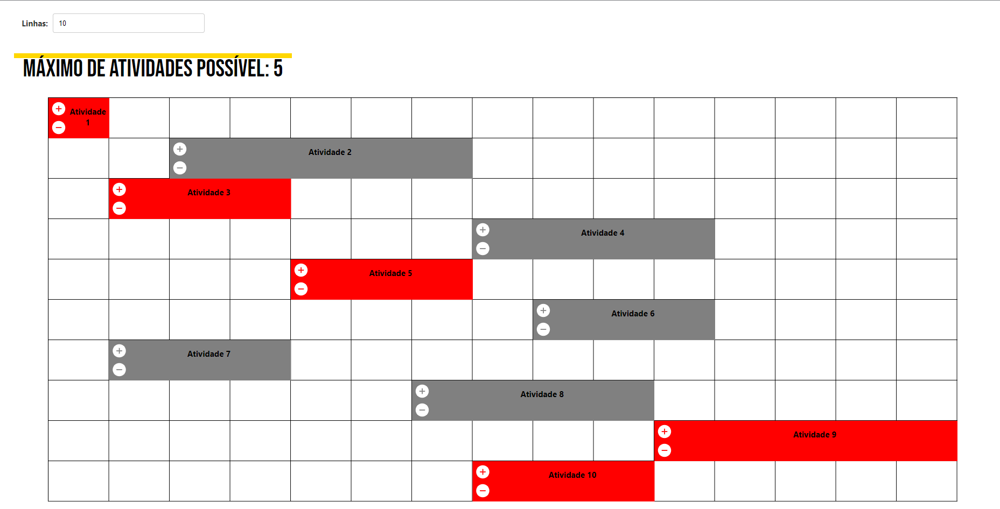
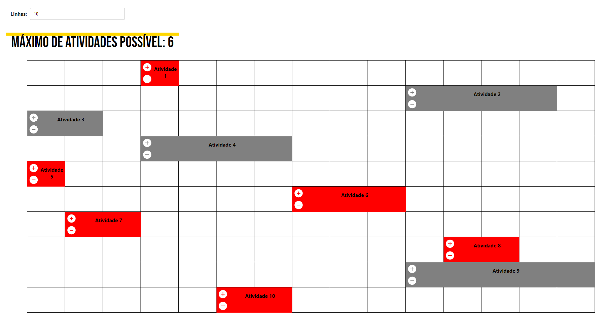
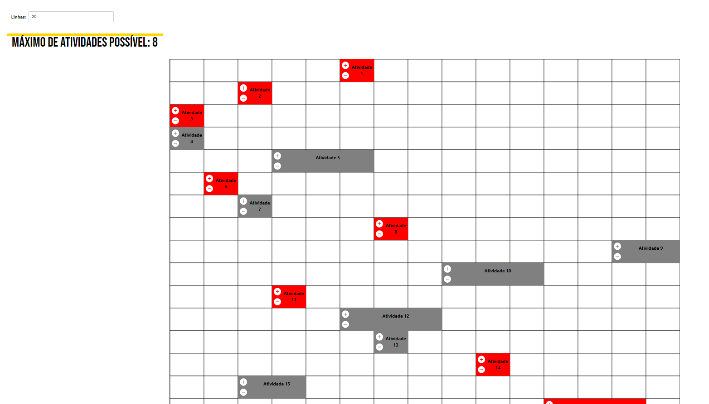

# Interval Scheduling

**Número da Lista**: 11
**Conteúdo da Disciplina**: Greed

## Alunos
|Matrícula | Aluno |
| -- | -- |
| 20/0026488  |  Rafael de Medeiros Nobre |

## Sobre 
O projeto a seguir é uma demonstração interativa e gráfica da utilização do algoritmo ambicioso _Interval Scheduling_

## Screenshots







## Apresentação

A apresentação pode ser encontrada no arquivo assets/apresentacao.mp4

## Instalação 
**Linguagem**: Javascript
**Framework**: React.js<br>

Para executar o projeto, é necessário ter o Node.js a partir da versão 16.0 instalado na máquina. clone o repositório e execute os passos:

**Passo 1**
```
cd interval_scheduling
```

**Passo 2**
```
npm install
```

## Uso 

Para executar o projeto, execute o código:

```
npm start
```

E abra o endereço http://localhost:3000

Na interface interativa, as atividades são arrastáveis, e podem ser seu tamanho alterado, clicando nos ícones de + e -

Também é possível aumentar a quantidade de linhas e de atividades


